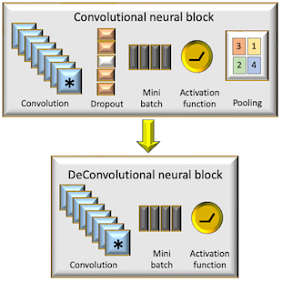

# Geometric Learning
Classes and methods for Geometric Learning and related topics.

#### Patrick Nicolas - Last update 11.01.2024

# Differential Geometry
__Differential geometry__ offers a solution by enabling data scientists to grasp the true shape and distribution of data.   
     
Differential geometry is a branch of mathematics that uses techniques from calculus, algebra and topology to study the properties of curves, surfaces, and higher-dimensional objects in space. It focuses on concepts such as curvature, angles, and distances, examining how these properties vary as one moves along different paths on a geometric object.  
Differential geometry is crucial in understanding the shapes and structures of objects that can be continuously altered, and it has applications in many fields including physics (I.e., general relativity and quantum mechanics), engineering, computer science, and data exploration and analysis.   
   
__Euclidean space__, created from a collection of maps (or charts) called an atlas, which belongs to Euclidean space. __Differential manifolds__ have a tangent space at each point, consisting of vectors. __Riemannian__ manifolds are a type of differential manifold equipped with a __metric__ to measure __curvature__, __gradient__, and __divergence__.
   

The directory __geometry__ contains the defintion and implementation the various elements of smooth manifolds using __Geomstats__ module.
- __Covariant__ and __contravariant__ vectors and tensors
- __Intrinsic__ and __Extrinsic__ coordinates
- Riemannian metric tensor
- Tangent space, __Exponential__ and __Logarithmic__ maps
- __Levi-Civita__ connection and parallel transport
- __Curvature__ tensor
- Euclidean, __hypersphere__ and __Kendal__ spaces
- Logistic regression and K-Means on hypersphere
- __Frechet mean__
- __Push-forward__ and __pull-back__

# Lie groups and Algebras
Lie groups play a crucial role in Geometric Deep Learning by modeling symmetries such as rotation, translation, and scaling. This enables non-linear models to generalize effectively for tasks like object detection and transformations in generative models.    
Lie groups have numerous practical applications in various fields:     
- __Physics__: They describe symmetries in classical mechanics, quantum mechanics, and relativity. 
- __Robotics__: Lie groups model the motion of robots, particularly in the context of rotation and translation (using groups like SO(3) and SE(3)).
- __Control Theory__: Lie groups are used in the analysis and design of control systems, especially in systems with rotational or symmetrical behavior.
- __Computer Vision__: They help in image processing and 3D vision, especially in tasks involving rotations and transformations.
- __Differential Equations__: Lie groups are instrumental in solving differential equations by leveraging symmetry properties.

    
The directory __Lie__ illustrates the various element of __Special Orthogonal Group__ of 3 dimension (__SO3__) and __Special Euclidean Group__ in 3 dimension (__SE3__) using __Geomstats__ library. 

# Deep learning
The directory __dl__ implements a framework of __reusable neural blocks__ as key components of any deep learning models such as:
- Feed forward neural network
- Convolutional network
- Variational auto-encoder
- Generative adversarial network
- Automatic generation (mirror) of encoder/de-convolutional blocks.   

# Markov Chain Monte Carlo
Sampling sits at the core of data science and analysis. The directory __mcmc__ explores a category of numerical sampling techniques, known as Markov Chain Monte Carlo, and how they can be implemented via reusable design patterns, using the __Metropolis-Hastings__ model as an example.     

# Signal processing
A Kalman filter serves as an ideal estimator, determining parameters from imprecise and indirect measurements. Its goal is to reduce the mean square error associated with the model's parameters. Being recursive in nature, this algorithm is suited for real-time signal processing.    
   
The directory __control__ contains the implementation of __Kalman__ filters.
    

# References
-[Deep learning with reusable neural blocks](http://patricknicolas.blogspot.com/2023/03/building-bert-with-reusable-neural.html)    
-[Geometric Learning in Python - Basic](https://patricknicolas.blogspot.com/2024/02/introduction-to-differential-geometry.html)    
-[Differentiable Manifolds](https://patricknicolas.blogspot.com/2024/03/geometric-learning-in-python-manifolds.html)    
-[Differential Operators in Python](https://patricknicolas.blogspot.com/2023/12/explore-differential-operators-in-python.html)    
-[Intrinsic Representation](https://patricknicolas.blogspot.com/2024/03/geometric-learning-in-python-coordinates.html)   
-[Vector and Covector Fields](https://patricknicolas.blogspot.com/2024/04/geometric-learning-in-python-vector.html)    
-[Vector Operators](https://patricknicolas.blogspot.com/2024/04/geometric-learning-in-python-vector_3.html)   
-[Non-linear Functional Data Analysis](https://patricknicolas.blogspot.com/2024/04/geometric-learning-in-python-functional.html)   
-[Riemann Metric and Connection](https://patricknicolas.blogspot.com/2024/04/geometric-learning-in-python-riemann.html)   
-[Riemann Curvature Tensor](https://patricknicolas.blogspot.com/2024/04/geometric-learning-in-python-riemann_18.html)   

