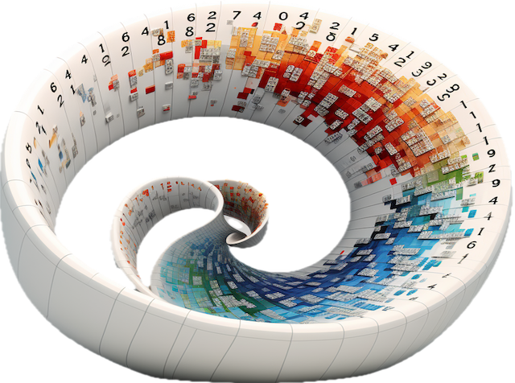

# Geometric Learning
Classes and methods for Geometric Learning

#### Patrick Nicolas - Last update 04.25.2024

# Differential Geometry

# Deep learning

# Geometric Deep Learning

# References
-[Deep learning with reusable neural blocks](http://patricknicolas.blogspot.com/2023/03/building-bert-with-reusable-neural.html)    
-[Geometric Learning in Python - Basic](https://patricknicolas.blogspot.com/2024/02/introduction-to-differential-geometry.html)    
-[Differentiable Manifolds](https://patricknicolas.blogspot.com/2024/03/geometric-learning-in-python-manifolds.html)    
-[Differential Operators in Python](https://patricknicolas.blogspot.com/2023/12/explore-differential-operators-in-python.html)    
-[Intrinsic Representation](https://patricknicolas.blogspot.com/2024/03/geometric-learning-in-python-coordinates.html)   
-[Vector and Covector Fields](https://patricknicolas.blogspot.com/2024/04/geometric-learning-in-python-vector.html)    
-[Vector Operators](https://patricknicolas.blogspot.com/2024/04/geometric-learning-in-python-vector_3.html)   
-[Non-linear Functional Data Analysis](https://patricknicolas.blogspot.com/2024/04/geometric-learning-in-python-functional.html)   
-[Riemann Metric and Connection](https://patricknicolas.blogspot.com/2024/04/geometric-learning-in-python-riemann.html)   
-[Riemann Curvature Tensor](https://patricknicolas.blogspot.com/2024/04/geometric-learning-in-python-riemann_18.html)   

