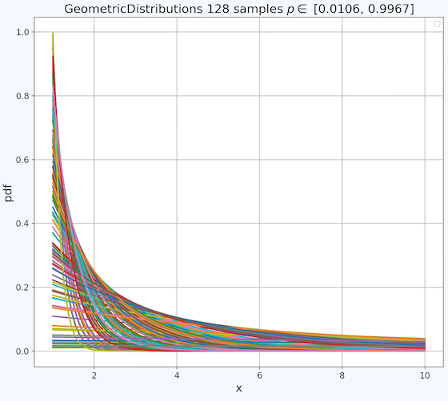
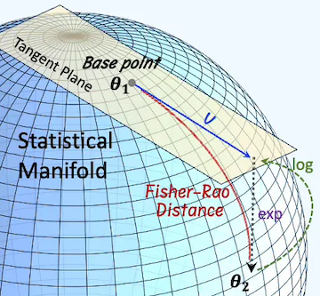
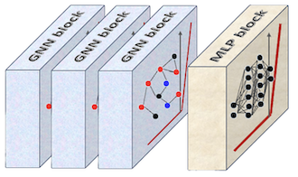
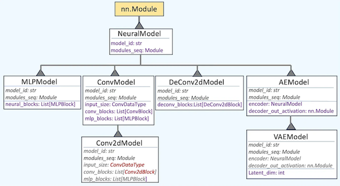

#### Classes and methods for Geometric Deep Learning and related topics to support 💬 [Substack - Newsletter](https://patricknicolas.substack.com)  and 💬 [LinkedIn Articles](https://www.linkedin.com/newsletters/geometric-learning-in-python-7175924072638263296/)     
#### _Patrick Nicolas - Last update 07.12.2025_
.  

.   
.  

# 🎯 Why it Matters
### Purpose:      
_Facing challenges with high-dimensional, densely packed but limited data, and complex distributions_?     
Geometric Deep Learning (GDL) offers a solution by enabling data scientists to grasp the true shape and distribution of data. This newsletter explores the diverse techniques and frameworks shaping the field of Geometric Deep Learning.

### Audience:       
Data Scientists or machine learning engineers involved in fields of research or applications such as Computer Vision, Robotics, Physics-informed Modeling, Molecular Science, Telecommunication Network Optimization, Transport Systems, Cosmology, Fluid Dynamics or Design Optimization.     

### Value:      
Learn about Geometric Learning, Graph Neural Networks, Manifolds, Equivariance and Lie Groups or Topological data analysis and unlocks the ability to model complex, structured, and relational data.

#  🎨 Theory    

Geometric Deep Learning (GDL) is a field of machine learning that generalizes deep learning to non-Euclidean domains—such as graphs, manifolds, groups, and other structured geometric spaces—by leveraging their symmetries and topologies.   
.   
The key concepts are:   
✅ __Invariance__: Output stays the same when input is transformed.     
✅ __Equivariance__: Preserves transformations. The output transforms predictably when input is transformed.    
✅ __Manifolds__: Operates directly on Non-euclidean or curved spaces or tangent spaces.     
✅ __Locality__: Uses local node structures and infinitesimal neighborhoods.    
     
Here are some references to get you feet wet!     

- [Geometric deep learning: going beyond Euclidean data M. Bronstein, J. Bruna, Y. LeCun, A. Szlam, P. Vadergheynst - 2017](https://arxiv.org/pdf/1611.08097)      
- [Geometric Deep Learning Grids, Groups, Graphs, Geodesics, and Gauges M. Bronstein, J. Bruna, T Cohen, P. Veličković  - 2021](https://arxiv.org/pdf/2104.13478)     
- [Theory of Graph Neural Networks: Representation and Learning S Jegelka, Dept. of EECS and CSAIL, MIT, 2022](https://arxiv.org/pdf/2204.07697)     
- [AMMI 2022 Course "Geometric Deep Learning" Lectures 1 to 12  M. Bronstein, J. Bruna, T Cohen, P. Veličković  - YouTube - 2022](https://www.youtube.com/watch?v=5c_-KX1sRDQ)     
- [Topological Deep Learning: Going Beyond Graph Data M Hajij et All - 2023](https://arxiv.org/pdf/2206.00606)      
- [A Brief Introduction to Geometric Deep Learning - J. McEwen, Medium - 2023](https://medium.com/data-science/a-brief-introduction-to-geometric-deep-learning-dae114923ddb)      
- [A Hands-on Introduction to Geometric Deep Learning, with Examples in PyTorch Geometric - G. Santin, A minitutorial at the SIAM Conference on Computational Science and Engineering, 2023](https://medium.com/data-science/a-brief-introduction-to-geometric-deep-learning-dae114923ddb)    
- [Michael Bronstein - Geometric Deep Learning  EEML Community - YouTube - 2024](https://www.youtube.com/watch?v=TLeofz0o7uY)       
- [Introduction To Geometric Deep Learning  Patrick Nicolas Substack - 2025](https://patricknicolas.substack.com/p/introduction-to-geometric-deep-learning)  


## Differential Geometry
__Differential geometry__ offers a solution by enabling data scientists to grasp the true shape and distribution of data.    
Differential geometry is a branch of mathematics that uses techniques from calculus, algebra and topology to study the properties of curves, surfaces, and higher-dimensional objects in space. It focuses on concepts such as curvature, angles, and distances, examining how these properties vary as one moves along different paths on a geometric object.  
Differential geometry is crucial in understanding the shapes and structures of objects that can be continuously altered, and it has applications in many fields including physics (I.e., general relativity and quantum mechanics), engineering, computer science, and data exploration and analysis.   
   
__Euclidean space__, created from a collection of maps (or charts) called an atlas, which belongs to Euclidean space. __Differential manifolds__ have a tangent space at each point, consisting of vectors. __Riemannian__ manifolds are a type of differential manifold equipped with a __metric__ to measure __curvature__, __gradient__, and __divergence__.
   


The directory __geometry__ contains the definition and implementation the various elements of smooth manifolds using __Geomstats__ module.
- __Covariant__ and __contravariant__ vectors and tensors
- __Intrinsic__ and __Extrinsic__ coordinates
- Riemannian metric tensor
- Tangent space, __Exponential__ and __Logarithmic__ maps
- __Levi-Civita__ connection and parallel transport
- __Curvature__ tensor
- Euclidean, __hypersphere__ and __Kendal__ spaces
- Logistic regression and K-Means on hypersphere
- __Frechet mean__
- __Push-forward__ and __pull-back__     


    

## Lie Groups and Algebras
Lie groups play a crucial role in Geometric Deep Learning by modeling symmetries such as rotation, translation, and scaling. This enables non-linear models to generalize effectively for tasks like object detection and transformations in generative models.    
     
Lie groups have numerous practical applications in various fields:        
✅ __Robotics__: Lie groups model the motion of robots, particularly in the context of rotation and translation (using groups like SO(3) and SE(3)).    
✅ __Control Theory__: Lie groups are used in the analysis and design of control systems, especially in systems with rotational or symmetrical behavior.     
✅ __Computer Vision__: They help in image processing and 3D vision, especially in tasks involving rotations and transformations.    
✅ __Differential Equations__: Lie groups are instrumental in solving differential equations by leveraging symmetry properties.         


The directory __Lie__ illustrates the various element of __Special Orthogonal Group__ of 3 dimension (__SO3__) and __Special Euclidean Group__ in 3 dimension (__SE3__) using __Geomstats__ library.      
     

__Note__: _Visualizing the SO(3) manifold in three dimensions is inherently challenging. In this example, we represent the space of rotations as a solid ball, where the center corresponds to the identity rotation and each point within the ball encodes a rotation using the axis-angle representation_.
[Reference: SO3 Visualization](https://en.wikipedia.org/wiki/Charts_on_SO(3))  

## Equivariance
👉 __Lie-equivariant networks__ are neural networks that are equivariant to transformations from a Lie group, such as rotations, translations, scaling, or Lorentz transformations. These networks are designed to respect the continuous symmetries inherent in many scientific and geometric problems.    

👉 __Group-equivariant Convolutional Neural Networks__ (G-CNN) are a generalization of standard Convolutional Neural Networks designed to respect symmetries in data, especially group symmetries (translational, Rotational, Reflectional and Permutational).    

## Graph Neural Networks    
### Overview
Graph Neural Networks (GNNs) are a class of deep learning models designed to operate directly on graph-structured data. Unlike standard neural networks that work on fixed-size vectors or grids (like images or sequences), GNNs handle data where relationships are represented as nodes and edges—like social networks, molecules, recommendation systems, and more.    

There are 3 levels or categories of tasks:    
- __Graph-level task__: Predict the property of the entire graph such as classification problems with MNIST or CIFAR images or sentiment analysis for a document or paragraph.      
- __Node-level task__: Predict if a node belongs to a specific class (i.e. Karate club) or image segmentation (identify the role of a pixel in an image) or part of speech a word belongs to.        
- __Edge-level task__: Predict the relationship between node (i.e. Interaction between users) that can be classified (discovery of connections between entities or nodes). The task also consists in pruning a fully connected graph into a sparse graph.       
    
The key Attributes that define the complexity of a Graph Neural Network are     
- Number of graph convolutional and attention layers    
- Graph pooling layer      
- Node or edge neighbor sampling method       
- Residual connections    
- Heteromophilic nodes      
- Inclusion of isolated nodes      
- Aggregation method      
- Data transformation prior aggregation       

There are many types of Graph Neural Networks as new ones are regularly introduced in research papers. Here is the list of the 5 common types of Graph Neural Networks:         
✅ Graph Convolutional Networks    
✅ Graph Attention Networks     
✅ GraphSAGE    
✅ Spectral Graph Neural Networks    
✅ Graph Transformers

### Homophily    
The homophily ratio in a Graph Neural Network (GNN) quantifies how often nodes in a graph are connected to other nodes with the same label or class. It’s a key measure for understanding how well GNNs are likely to perform, especially those that rely on message passing—which typically assumes that connected nodes share similar features or labels.     

There are 3 homophily ratios:     
✅ __Node homophily__: average fraction of same-label neighbors per node.
✅__Edge homophily__: fraction of edges connecting nodes with the same label     
✅__Class-insensitive edge homophily__: adjusts for class imbalance by computing same-label edge fractions per class, then averaging. across the C classes.    

### PyTorch Geometric    
Since its introduction in early 2019, PyTorch Geometric has expanded significantly, incorporating new models, graph samplers, and transformations, continuously evolving to align with the latest research publications.     

The key Features of PyTorch Geometric are:    
- __Efficient Graph Processing__: Optimizes memory and computation using sparse graph representations.    
- __Flexible GNN Layers__: Covers GCN, GAT, GraphSAGE, GIN, and other advanced architectures.     
- __Batching for Large Graphs__: Supports for mini-batching for handling graphs with millions of edges.     
- __Seamless PyTorch Integration__: Provides full compatibility with PyTorch tensors, autograd, and neural network modules.      
- __Diverse Graph Support__: PyTorch Geometric handles directed, undirected, weighted, and heterogeneous graphs.     

The most important PyG Modules are:      
✅ __torch_geometric.data__ to manages graph structures, including nodes, edges, and features.        
✅ __torch_geometric.nn__ to provide data scientists prebuilt GNN layers like convolutional and gated layers.        
✅ __torch_geometric.transforms__ to pre-process input data (e.g., feature normalization, graph sampling).     
✅ __torch_geometric.loader__ to handle large-scale graph datasets with specialized loaders.


## Information Geometry
__Information geometry__ applies the principles and methods of differential geometry to problems in probability theory and statistics. It studies the manifold of probability distributions and provides a natural framework for understanding and analyzing statistical models.     
The directory __informationgeometry__ focuses on the __Fisher Information Metric__ (FIM).    
    
### Smooth Statistical Manifolds    
Statistical manifolds generalize the concept of Riemannian manifolds to the space of probability distributions. While their geometric properties—such as exponential and logarithm maps or distance—are often intractable, univariate distributions typically allow for closed-form or analytical expressions of these properties.    
Most of Statistical manifolds (with 2 or more parameters) have intractable exponential, logarithm and inner production formulation. However single parameters distribution have closed-form formulation:     
- __Exponential Distribution__    
- __Poisson Distribution__
- __Geometric Distribution__
- __Binomial Distribution with fixed draw__   

Example:   Geometric Distribution    

Reference [Geometry of Closed-form Statistical Manifolds]


### Fisher-Rao Metric    
The Fisher Information Matrix plays a crucial role in various aspects of machine learning and statistics. Its primary significance lies in providing a measure of the amount of information that an observable random variable carries about an unknown parameter upon which the probability depends on.   
The Fisher information matrix is a type of __Riemannian metric__ that can be applied to a __smooth statistical manifold__. It serves to quantify the informational difference between measurements. The points on this manifold represent probability measures defined within a Euclidean probability space, such as the Normal distribution. Mathematically, it is represented by the Hessian of the __Kullback-Leibler__ divergence.




## Deep Learning Models
The directory __dl__ implements a framework of __reusable neural blocks__ as key components of any deep learning models such as:     
✅ Feed forward neural network/Multilayer perceptron  
✅ Convolutional network    
✅ Variational auto-encoder      
✅ Generative adversarial network       
✅ Automatic generation (mirror) of encoder/de-convolutional blocks.   


## Fractal Dimension
Configuring the parameters of a 2D convolutional neural network, such as kernel size and padding, can be challenging because it largely depends on the complexity of an image or its specific sections. __Fractals__ help quantify the complexity of important features and boundaries within an image and ultimately guide the data scientist in optimizing his/her model.    

A __fractal dimension__ is a measure used to describe the complexity of fractal patterns or sets by quantifying the ratio of change in detail relative to the change in scale.    
For ordinary geometric shapes, the fractal dimension theoretically matches the familiar Euclidean or __topological dimension__.    

There are many approaches to compute the fractal dimension of an image, among them:
- Variation method
- Structure function method
- Root-mean-square method
- R/S analysis method
- Box counting method

The directory 'fractal' contains the implementation of the __box counting method__ for images and 3D objects.

## Markov Chain Monte Carlo
Sampling sits at the core of data science and analysis. The directory __mcmc__ explores a category of numerical sampling techniques, known as Markov Chain Monte Carlo, and how they can be implemented via reusable design patterns, using the __Metropolis-Hastings__ model as an example.     

## Signal Processing
A Kalman filter serves as an ideal estimator, determining parameters from imprecise and indirect measurements. Its goal is to reduce the mean square error associated with the model's parameters. Being recursive in nature, this algorithm is suited for real-time signal processing.    
   
The directory __control__ contains the implementation of __Kalman__ filters.
    


# ⚙️ Reusable Neural Components Design
## Neural Blocks
A __block__ is defined as a logical grouping of neural components, implemented as Pytorch __Module__. All these components are assembled into a sequential set of torch modules.   
```
class NeuralBlock(nn.Module):
    def __init__(self, block_id: Optional[AnyStr], modules: Tuple[nn.Module]):
        super(NeuralBlock, self).__init__()
        self.modules = modules
        self.block_id = block_id
```

### Multi-layer Perceptron Block
A MLP block a __fully-connected layer__, an activation function, and possibly a drop-out component.    
     
    
.     
```
class MLPBlock(NeuralBlock):
    def __init__(self,
                 block_id: AnyStr,
                 layer_module: nn.Linear,
                 activation_module: Optional[nn.Module] = None,
                 dropout_module: Optional[nn.Dropout] = None) -> None:
        # A MLP block should contain at least a fully connected layer
        modules = [layer_module]
        # Add activation module if defined
        if activation_module is not None:
            modules.append(activation_module)
        # Add drop out module if specified
        if dropout_module is not None:
            modules.append(dropout_module)
        super(MLPBlock, self).__init__(block_id, modules)
        self.activation_module = activation_module
```
    
### Convolutional Network Block

A Convolutional block may include a __convolutional layer__, kernel, batch normalization and possibly a drop-out components of type __Module__.     
     
   

```
class Conv2dBlock(ConvBlock):
    valid_modules = ('Conv2d', 'MaxPool2d', 'BatchNorm2d', 'Dropout2d')

    def __init__(self,
                 block_id: AnyStr,
                 conv_layer_module: nn.Conv2d,
                 batch_norm_module: Optional[nn.BatchNorm2d] = None,
                 activation_module: Optional[nn.Module] = None,
                 max_pooling_module: Optional[nn.MaxPool2d] = None,
                 drop_out_module: Optional[nn.Dropout2d] = None) -> None:
        # The 2-dimensional convolutional layer has to be defined
        modules = [conv_layer_module]

        # Add a batch normalization is provided
        if batch_norm_module is not None:
            modules.append(batch_norm_module)
        # Add an activation function is required
        if activation_module is not None:
            modules.append(activation_module)
        # Add a mandatory max pooling module
        if max_pooling_module is not None:
            modules.append(max_pooling_module)
        # Add a Drop out regularization for training if provided
        if drop_out_module is not None:
            modules.append(drop_out_module)
        super(Conv2dBlock, self).__init__(block_id, modules)
```
### Graph Neural Block

    
    
    
```
class GConvBlock(nn.Module):
    def __init__(self,
                 block_id: AnyStr,
                 gconv_layer: GraphConv,
                 batch_norm_module: Optional[BatchNorm] = None,
                 activation_module: Optional[nn.Module] = None,
                 pooling_module: Optional[SAGPooling | TopKPooling] = None,
                 dropout_module: Optional[nn.Dropout] = None) -> None:

        super(GConvBlock, self).__init__()
        self.block_id = block_id
        # Iteratively build the sequence of Torch Module according
        # to the order of the arguments of the constructor
        modules: List[nn.Module] = [gconv_layer]
        if batch_norm_module is not None:
            modules.append(batch_norm_module)
        if activation_module is not None:
            modules.append(activation_module)
        if pooling_module is not None:
            modules.append(pooling_module)
        if dropout_module is not None:
            modules.append(dropout_module)
        self.modules = modules
```
    
### Neural Blocks Class Hierarchy
    
The current hierarchy of neural blocks is defined as:     
      
   
   

    
## Neural Models
Neural models are dynamic sequence of neural blocks that are assembled and converted into a sequence of torch __Module__ instances.   
The Base class for Neural model is defined as     
```
class NeuralModel(torch.nn.Module, ABC):
    def __init__(self, model_id: AnyStr, modules_seq: nn.Module) -> None:
        super(NeuralModel, self).__init__()
        self.model_id = model_id
        self.modules_seq = modules_seq
        
    def forward(self, x: torch.Tensor) -> torch.Tensor:
        return self.model(x)
```
Each model inherits from __NeuralModel__ (i.e. Convolutional neural network type : __ConvModel__)

### MLP Model Builder
A Multi-layer Perceptron generated from reusable neural blocks
    
   
```
class MLPModel(NeuralModel):
    def __init__(self, model_id: AnyStr, neural_blocks: List[MLPBlock]) -> None:
        self.neural_blocks = neural_blocks
        # Define the sequence of modules from the layout of neural blocks
        modules = [module for block in neural_blocks
                   for module in block.modules]
        super(MLPModel, self).__init__(model_id, nn.Sequential(*modules))
```
    
   
and it associated builder pattern.   
    
    
      
with implementation....     
```
class MLPBuilder(NeuralBuilder):
    keys = ['in_features_list', 'activation', 'drop_out', 'output_activation']

    def __init__(self, model_id: AnyStr) -> None:
        super(MLPBuilder, self).__init__(model_id, MLPBuilder.keys)
        # Default configuration parameters that can be overwritten
        self._attributes['activation'] = nn.ReLU()
        self._attributes['drop_out'] = 0.0

    def build(self) -> MLPModel:
        # Instantiate the model from the dictionary of Configuration parameters
        mlp_blocks = self.__create_blocks()
        # Validation
        MLPBuilder.validate(mlp_blocks)
        return MLPModel(self._attributes['model_id'], mlp_blocks)
```

### Convolutional Model Builder
A convolutional neural network is generated from reusable neural blocks using the __Builder recursive pattern__.    
     

```
class Conv2dModel(ConvModel):
    def __init__(self,
                 model_id: AnyStr,
                 input_size: Conv2DataType,
                 conv_blocks: List[Conv2dBlock],
                 mlp_blocks: Optional[List[MLPBlock]] = None) -> None:
        super(Conv2dModel, self).__init__(model_id, input_size, conv_blocks, mlp_blocks)
```
    
    
with its builder:    
```
class Conv2dBuilder(NeuralBuilder):
    keys = ['input_size', 'in_channels_list', 'kernel_size', 'stride',
            'padding', 'is_batch_norm', 'max_pool_kernel', 'activation',
            'in_features_list', 'output_activation', 'bias', 'drop_out']

    def __init__(self, model_id: AnyStr) -> None:
        super(Conv2dBuilder, self).__init__(model_id, Conv2dBuilder.keys)
        # Provide default values that may be overwritten.
        self._attributes['stride'] = (1, 1)
        self._attributes['padding'] = (1, 1)
        self._attributes['is_batch_norm'] = True
        self._attributes['activation'] = nn.ReLU()
        self._attributes['bias'] = False
        self._attributes['drop_out'] = 0.0

    def build(self) -> Conv2dModel:
        # Instantiate the model from the dictionary of Configuration parameters
        model_id = self._attributes['model_id']
        # Generate the convolutional neural blocks from the configuration attributes dictionary
        conv_blocks = self.__create_conv_blocks()
        # Generate the fully connected blocks from the configuration attributes dictionary
        mlp_blocks = self.__create_mlp_blocks()
        # Validation
        Conv2dBuilder.__validate(conv_blocks, mlp_blocks, self._attributes['input_size'])
        return Conv2dModel(model_id, self._attributes['input_size'], conv_blocks, mlp_blocks)
```
   
    
### Graph Neural Network Builder 
    
     
       
```
class GConvModel(nn.Module):
    def __init__(self,
                 model_id: AnyStr,
                 gconv_blocks: List[GConvBlock],
                 mlp_blocks: Optional[List[MLPBlock]] = None) -> None:
        super(GConvModel, self).__init__()

        self.model_id = model_id
        self.gconv_blocks = gconv_blocks
        # Extract the torch modules for the convolutional blocks
        # in the appropriate order
        modules: List[nn.Module] = [module for block in gconv_blocks
                                    for module in block.modules]
        # If fully connected are provided as CNN
        if mlp_blocks is not None:
            self.mlp_blocks = mlp_blocks
            # Flatten the output from the last convolutional layer
            modules.append(nn.Flatten())
            # Extract the relevant modules from the fully connected blocks
            [modules.append(module) for block in mlp_blocks for module in block.modules]
        self.modules = modules
```
    

### Neural Models Class Hierarchy

The current class hierarchy for Neural models is defined as:    
    



##  🛠️ Environment

| Library         | Version |
|:----------------|:--------|
| Python          | 3.12.9  |
| SymPy           | 1.12    |
| Numpy           | 2.1.3   |
| Pydantic        | 2.4.1   |
| Shap            | 0.43.0  |
| torch           | 2.6.0   |
| torchVision     | 0.20.1  |
| torch-geometric | 2.6.1   |
| torch_sparse    | 0.6.18  |
| torch_scatter   | 2.12    |
| torch_cluster | 1.6.3   |
| Scikit-learn    | 1.5.2   |
| Geomstats       | 2.8.0   |
| Jax | 0.4.34  |
| PyTest | 8.3.3   |
| matplotlib | 3.10.0  |
| ffmpeg | 1.14  |
| latex | 0.7.0  |
| manim | 0.19.0  |
| memory-profiler | 0.61.0  |
| networkx | 3.4.2 |
| optuna | 4.4.0 |
| pillow | 11.1.0 |
| pytorch-lightning | 2.5.1 |
   

# Modules
   


# 📘 References
-[Introduction to Geometric Deep Learning](https://patricknicolas.substack.com/p/introduction-to-geometric-deep-learning)     
-[Riemannian Manifolds: Foundational Concepts](https://patricknicolas.substack.com/p/riemannian-manifolds-1-foundation)       
-[Riemannian Manifolds: Hands-on with Hypersphere](https://patricknicolas.substack.com/p/riemannian-manifolds-2-hands-on-with)        
-[Reusable Neural Blocks in PyTorch & PyG](https://patricknicolas.substack.com/p/reusable-neural-blocks-in-pytorch)        
-[Modular Deep Learning Models with Neural Blocks](https://patricknicolas.substack.com/p/modular-deep-learning-models-with)         
-[Taming PyTorch Geometric for Graph Neural Networks](https://patricknicolas.substack.com/p/taming-pytorch-geometric-for-graph)         
-[Practical Introduction to Lie Groups in Python](https://patricknicolas.substack.com/p/practical-introduction-to-lie-groups)         
-[Demystifying Graph Sampling & Walk Methods](https://patricknicolas.substack.com/p/demystifying-graph-sampling-and-walk)       
-[Modeling Graph Neural Networks with PyTorch](https://www.linkedin.com/pulse/modeling-graph-neural-networks-pyg-patrick-nicolas-ii61c)         
-[Fréchet Centroid on Manifolds in Python](https://www.linkedin.com/pulse/fr%C3%A9chet-centroid-manifolds-python-patrick-nicolas-bwflc)         
-[Visualization of Graph Neural Networks](https://www.linkedin.com/pulse/visualization-graph-neural-networks-patrick-nicolas-3atnc)        
-[Limitations of the Linear Kalman Filter](https://www.linkedin.com/pulse/limitations-linear-kalman-filter-patrick-nicolas-bqptc)        
-[Introduction to SO3 Lie Group in Python](https://www.linkedin.com/pulse/operations-so3-lie-group-python-patrick-nicolas-wifmc)          
-[Introduction to SE3 Lie Groups in Python](https://www.linkedin.com/pulse/introduction-se3-lie-groups-python-patrick-nicolas-dcixc)        
      
        
       